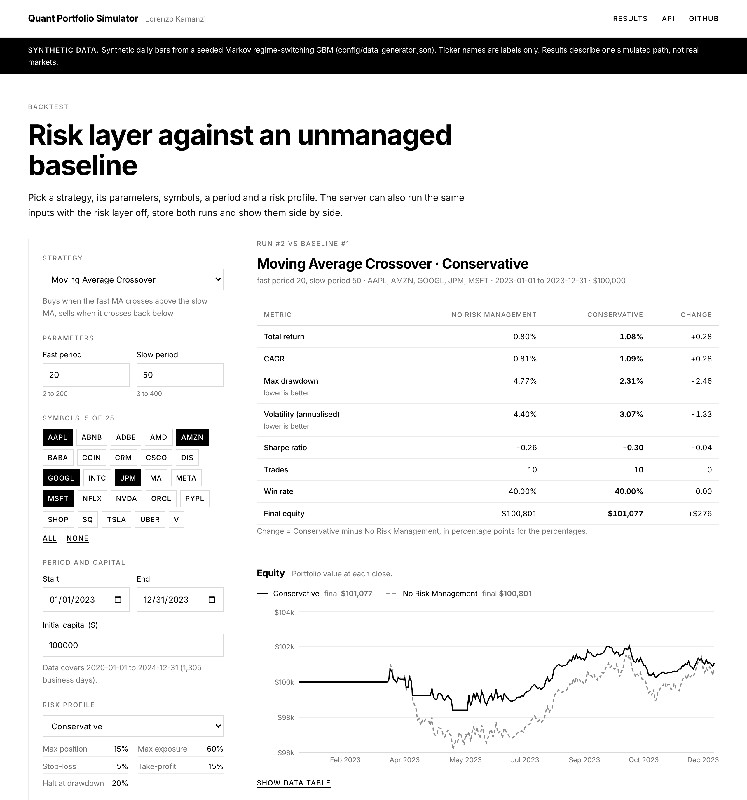
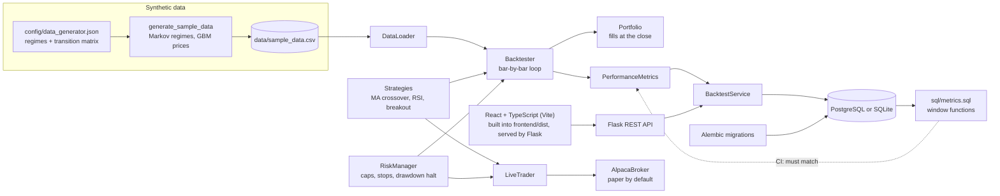

# Quant Portfolio Simulator

[](https://github.com/lokaz-c/quant/actions/workflows/ci.yml)

A daily-bar backtesting engine with three strategies, a risk layer that can be switched on and off, a performance-metrics module, a Flask REST API with a React + TypeScript frontend, and a paper-trading adapter for Alpaca. I built it to answer one question: what does a simple risk layer (position caps, stop-losses, a drawdown halt) do to a strategy compared with running it unmanaged? I wanted the answer measured by code anyone can re-run.

**The price data is synthetic.** It comes from a seeded generator: a Markov chain switches between bull, bear and sideways regimes, and each symbol follows a geometric Brownian motion with the current regime's drift and volatility. Ticker names are labels only. See [docs/data.md](docs/data.md). Any CSV with `timestamp, symbol, open, high, low, close, volume` columns can be used instead.



*A local run (`make dev`, SQLite) on the synthetic sample data: Moving Average Crossover on 5 symbols over 2023, with the Conservative profile against the same run with the risk layer off. Captured by `python -m scripts.screenshot`.*

## Architecture



On each bar the engine:

1. marks positions to the close;
2. if the risk layer is on, applies stop-loss and take-profit and checks drawdown;
3. asks the strategy for orders;
4. passes them through the risk rules;
5. fills them at that bar's close.

Open positions are closed on the last bar. Each run is stored with its equity curve and trades.

## Run it

```bash
git clone https://github.com/lokaz-c/quant && cd quant
make run          # docker compose up --build: PostgreSQL 15 + the app
# open http://localhost:8000  (QUANT_PORT=9000 make run to use another port)
```

I checked this from a clean clone. It needs only Docker: the image build compiles the frontend in a Node 24 stage, and Flask serves it with the API. The sample data is committed. On start, `init_db.py` brings the schema to the latest migration (`alembic upgrade head`) and seeds the strategies and risk profiles from `config/`.

Without Docker (Python 3.10 or 3.11 and Node 24, SQLite):

```bash
python3 -m venv .venv && source .venv/bin/activate
make install
make dev            # builds frontend/dist, then serves app and API on http://localhost:8000
make test           # Python tests
make test-frontend  # TypeScript check and vitest
```

For frontend work, run `make frontend-dev` next to `make dev`. It serves the app with hot reload on http://localhost:5173 and proxies `/api` to Flask.

`make help` lists the other targets: `frontend`, `migrate`, `test-pg`, `sql-check`, `data`, `results`, `bench`, `down`, `db-shell`.

## Results

`make results` runs each strategy with the risk layer off and under each risk profile. It uses 5 symbols, 2020-01-01 to 2024-12-31 (1,305 bars), $100,000 of capital and the seed-42 data file, and writes [docs/results.md](docs/results.md). The run has no randomness and the file has no timestamps, so it is reproducible byte for byte. CI regenerates it and fails if the committed copy is stale. Excerpt, with the risk layer off ("No Risk Management") and with the Conservative profile:

| Strategy | Risk profile | Total return | CAGR | Max drawdown | Volatility | Sharpe | Trades | Win rate |
| --- | --- | ---: | ---: | ---: | ---: | ---: | ---: | ---: |
| Moving Average Crossover | No Risk Management | 1.51% | 0.30% | 20.24% | 6.89% | -0.21 | 58 | 41.38% |
| Moving Average Crossover | Conservative | 16.94% | 3.18% | 5.09% | 4.13% | 0.27 | 61 | 42.62% |
| RSI Mean Reversion | No Risk Management | -29.04% | -6.63% | 37.53% | 7.58% | -1.10 | 71 | 53.52% |
| RSI Mean Reversion | Conservative | -15.79% | -3.38% | 20.63% | 4.88% | -1.06 | 121 | 41.32% |
| Trend Following | No Risk Management | -2.28% | -0.46% | 17.06% | 4.60% | -0.51 | 84 | 39.29% |
| Trend Following | Conservative | -1.87% | -0.38% | 13.26% | 3.41% | -0.68 | 87 | 37.93% |

On this one simulated path, the Conservative profile gave a shallower max drawdown for all three strategies. The looser profiles did less: Aggressive never changed the Trend Following result, and it slightly deepened the RSI drawdown. These figures come from synthetic prices, so they describe the engine's behaviour, not any real-world edge. The full tables, including all profiles and returns split by regime, are in [docs/results.md](docs/results.md).

## Performance

`make bench` times `Backtester.run()` (CSV load, simulation, metrics) and writes [docs/benchmark.md](docs/benchmark.md) with the machine details. The median of 5 runs on an Apple M1 Pro (8 cores, 16 GiB, macOS 26.4, Python 3.11.15):

| Case | Bars (days) | Rows (bars x symbols) | Median |
| --- | ---: | ---: | ---: |
| 5 symbols, 1 year | 262 | 1,310 | 0.49 s |
| 5 symbols, 5 years | 1,305 | 6,525 | 3.46 s |
| 25 symbols, 5 years (full sample file) | 1,305 | 32,625 | 26.72 s |

The machine was busy with other work during this run; its load average is recorded in the benchmark file. Time per bar grows with the amount of data because the engine recomputes indicators over the full history on every bar (see Limitations).

## What's in it

- **Strategies** (`backtest_engine/strategies/`), each a `StrategyBase` subclass implementing `generate_signals(data, portfolio) -> List[Order]`:
  - Moving Average Crossover: 20/50-day; long on a cross up, flat on a cross down.
  - RSI Mean Reversion: 14-day RSI computed from simple averages; buy below 30, sell above 70.
  - Trend Following: buy when the close breaks the previous 20-day high; exit below the previous 20-day low or below a chandelier stop (20-day high minus 2 × ATR(14)).
- **Risk layer** (`backtest_engine/risk.py`): max position size and max exposure (oversized orders are cut down, not rejected), stop-loss, take-profit, and a max-drawdown halt that blocks new entries. There are four profiles in `config/risk_configs.json`, one of them with the risk layer off.
- **Metrics** (`backtest_engine/metrics.py`):
  - returns and risk: total return, CAGR, max drawdown, annualised volatility, Sharpe (2% risk-free)
  - trades: win rate, average win and loss, profit factor, trade count, win and loss streaks
  - returns split by regime
- **SQL cross-check** (`sql/metrics.sql`): max drawdown, volatility, Sharpe and a 63-day rolling Sharpe, recomputed in PostgreSQL from the stored equity curve with window functions (a running `MAX() OVER`, `LAG`, and `STDDEV_SAMP()` over a `ROWS BETWEEN 62 PRECEDING` frame). CI checks them against the Python metrics: within 1e-9 on the same stored values, and within 1e-5 against the engine's unrounded numbers. `make sql-check` runs the comparison on the 12 benchmark runs. Conventions and tolerances are in [docs/sql-metrics.md](docs/sql-metrics.md).
- **Frontend** (`frontend/`): React 19 and TypeScript, built by Vite and served by Flask from `frontend/dist`.
  - a run form: strategy, parameters (checked against each strategy's limits), symbols, dates, capital and risk profile;
  - the chosen profile against the same run with the risk layer off: metrics side by side, and equity and drawdown curves on shared axes;
  - the closed trades of both runs, and the run history.
  Charts use Recharts (MIT). A banner labels the data as synthetic. The look follows lorenzokamanzi.com: black and white, Inter, square corners.
- **API** (`app/`): run a backtest (optionally with its unmanaged baseline), list and compare runs, run a regime analysis, and describe the data. Invalid input gets a 400 with the reason. See [docs/api.md](docs/api.md).
- **Storage**: SQLAlchemy models (`app/models/database.py`), with SQLite locally and PostgreSQL in Docker. Alembic migrations (`migrations/`) own the schema: money in `NUMERIC(18, 4)`, timestamps in `TIMESTAMPTZ`, CHECK constraints on the status columns and trade side, and a unique index on `equity_curve(backtest_run_id, timestamp)`. See [docs/database.md](docs/database.md) for the type choices.
- **Paper trading** (`live_trading/`): an alpaca-py adapter and a `LiveTrader` that runs any of the strategies, optionally with the risk layer. Paper trading is the default; live trading needs both `paper=False` and `QUANT_ALLOW_LIVE_TRADING=yes`. See [docs/live-trading.md](docs/live-trading.md).

## Tests and CI

There are 182 pytest tests (`pytest --collect-only -q`) and 20 frontend tests (vitest). The pytest tests cover:

- the data generator: cross-process determinism under different `PYTHONHASHSEED` values, and that the committed CSV matches the generator
- the Markov chain: empirical transition frequencies and mean regime durations against the matrix
- strategy signals, metrics, portfolio accounting and risk rules
- the Flask API, on temporary SQLite and on PostgreSQL: parameter overrides, baseline pairs, input validation (400s with the reason), and serving the built frontend
- the SQL cross-check: `sql/metrics.sql` against the Python metrics on six stored runs, a known-answer drawdown case and a flat curve
- the Alembic migrations, on SQLite and PostgreSQL: upgrade to head and downgrade to base, the models matching the head revision, the CHECK constraints and unique index rejecting bad rows, adopting a database created before Alembic, and existing rows surviving the type changes
- the paper-trading adapter, with fake clients
- that the results report is reproducible

51 tests need PostgreSQL and are skipped by `make test`; `make test-pg` runs the whole suite against a throwaway `postgres:15-alpine` container. Without `requirements-live.txt` installed (`make install-live`), the three tests that build real alpaca-py objects are also skipped. GitHub Actions installs it, runs the suite on Python 3.10 and 3.11 with a PostgreSQL 15 service container (the PostgreSQL tests fail rather than skip if it is missing), and checks that `docs/results.md` is current. A separate job type-checks, tests (vitest: formatting, drawdown maths, the API client, the form, the comparison table, the whole page against a mocked API) and builds the frontend on Node 24. mypy runs on the engine as an advisory step and does not fail the build.

## Limitations

- **Synthetic data only.** Symbols are independent given the shared regime, there are no fat tails within a regime, and the calendar is business days (holidays included). The results describe one simulated path (seed 42).
- **Optimistic fills.** Orders fill at the close of the bar that produced the signal, which assumes you can trade at a price only known at the close. There are no commissions, slippage, partial fills or shorting.
- **Idle cash earns nothing**, while Sharpe subtracts a 2% risk-free rate.
- **No cooldown after a stop-loss.** A strategy can re-enter on the same bar it was stopped out.
- **Runtime grows with history.** Every bar re-filters the data and recomputes indicators over the full history (see the benchmark). A backtest runs inside the HTTP request (two with the baseline on), and gunicorn's timeout is 300 s.
- **Paper trading is only tested against fake clients.** It has not been run against a funded account.
- **Risk profiles are hand-picked**, not fitted. mypy is advisory, not enforced.

## Docs

- [docs/data.md](docs/data.md): the synthetic data model, its parameters and how it is tested
- [docs/results.md](docs/results.md): benchmark backtests (generated)
- [docs/benchmark.md](docs/benchmark.md): timings (generated)
- [docs/api.md](docs/api.md): REST API
- [docs/database.md](docs/database.md): schema, migrations and column types
- [docs/sql-metrics.md](docs/sql-metrics.md): the SQL cross-check, its conventions and tolerances
- [docs/live-trading.md](docs/live-trading.md): Alpaca paper trading

## Deploying

The `Dockerfile` builds the whole app: the frontend in a Node stage, then the Python image that serves it. The app runs under gunicorn and reads `DATABASE_URL` and `SECRET_KEY` from the environment (see `.env.example`). `render.yaml`, `Procfile` and `runtime.txt` predate the frontend and install only the Python side, so they would serve the API without the UI. It is not deployed anywhere at the moment.

## License

MIT
