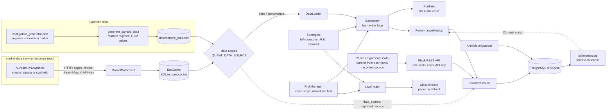

# Quant Portfolio Simulator

[](https://github.com/lokaz-c/quant/actions/workflows/ci.yml)

A daily-bar backtesting engine with three strategies, a risk layer that can be switched on and off, a performance-metrics module, a Flask REST API with a React + TypeScript frontend, and a paper-trading adapter for Alpaca. I built it to answer one question: what does a simple risk layer (position caps, stop-losses, a drawdown halt) do to a strategy compared with running it unmanaged? I wanted the answer measured by code anyone can re-run.

**Data.** Backtests run on one of two sources, and every run records which one it used:

- `synthetic` (the default, and what all published results use): a seeded generator in which a Markov chain switches between bull, bear and sideways regimes and each symbol follows a geometric Brownian motion with the current regime's drift and volatility. Ticker names are labels only. See [docs/data.md](docs/data.md).
- `market-data`: daily bars from my [market-data](https://github.com/lokaz-c/market-data) service (Java, Spring Boot, PostgreSQL), read through a local cache. The service labels each symbol `alpaca` or `synthetic`, and a run is shown as real only when every symbol is Alpaca data. Alpaca's terms forbid public display without written consent, so the service's public endpoints serve synthetic data unless a key unlocks more. See [docs/market-data.md](docs/market-data.md).

No results from real prices are published yet (TODO(lorenzo), see [Results](#results)).


*A local run (`make dev`, SQLite) on the synthetic sample data: Moving Average Crossover on 5 symbols over 2023, with the Conservative profile against the same run with the risk layer off. Captured by `python -m scripts.screenshot`.*

## Architecture



On each bar the engine:

1. marks positions to the close;
2. if the risk layer is on, applies stop-loss and take-profit and checks drawdown;
3. asks the strategy for orders;
4. passes them through the risk rules;
5. fills them at that bar's close.

Open positions are closed on the last bar. Each run is stored with its equity curve, its trades and where its bars came from.

## Run it

```bash
git clone https://github.com/lokaz-c/quant && cd quant
make run          # docker compose up --build: PostgreSQL 15 + the app
# open http://localhost:8000  (QUANT_PORT=9000 make run to use another port)
```

I checked this from a clean clone. It needs only Docker: the image build compiles the frontend in a Node 24 stage, and Flask serves it with the API. The sample data is committed. On start, `init_db.py` brings the schema to the latest migration (`alembic upgrade head`) and seeds the strategies and risk profiles from `config/`.

Without Docker (Python 3.10 or 3.11 and Node 24, SQLite):

```bash
python3 -m venv .venv && source .venv/bin/activate
make install
make dev            # builds frontend/dist, then serves app and API on http://localhost:8000
make test           # Python tests
make test-frontend  # TypeScript check and vitest
```

For frontend work, run `make frontend-dev` next to `make dev`. It serves the app with hot reload on http://localhost:5173 and proxies `/api` to Flask.

To run on bars from the market-data service, set `MARKET_DATA_URL` (and `MARKET_DATA_API_KEY` for Alpaca symbols); the other settings are in `.env.example` and [docs/market-data.md](docs/market-data.md). `make run-market-data` starts quant next to a local market-data stack built from `../market-data`. That stack has no Alpaca keys, so it serves only synthetic symbols (S001-S050), and the app labels every run on it synthetic.

`make help` lists the other targets: `frontend`, `migrate`, `test-pg`, `sql-check`, `data`, `results`, `results-real`, `bench`, `deploy-check`, `down`, `db-shell`.

## Results

`make results` runs each strategy with the risk layer off and under each risk profile. It uses 5 symbols, 2020-01-01 to 2024-12-31 (1,305 bars), $100,000 of capital and the seed-42 data file, and writes [docs/results.md](docs/results.md). The run has no randomness and the file has no timestamps, so it is reproducible byte for byte. CI regenerates it and fails if the committed copy is stale. Excerpt, with the risk layer off ("No Risk Management") and with the Conservative profile:

| Strategy | Risk profile | Total return | CAGR | Max drawdown | Volatility | Sharpe | Trades | Win rate |
| --- | --- | ---: | ---: | ---: | ---: | ---: | ---: | ---: |
| Moving Average Crossover | No Risk Management | 1.51% | 0.30% | 20.24% | 6.89% | -0.21 | 58 | 41.38% |
| Moving Average Crossover | Conservative | 16.94% | 3.18% | 5.09% | 4.13% | 0.27 | 61 | 42.62% |
| RSI Mean Reversion | No Risk Management | -29.04% | -6.63% | 37.53% | 7.58% | -1.10 | 71 | 53.52% |
| RSI Mean Reversion | Conservative | -15.79% | -3.38% | 20.63% | 4.88% | -1.06 | 121 | 41.32% |
| Trend Following | No Risk Management | -2.28% | -0.46% | 17.06% | 4.60% | -0.51 | 84 | 39.29% |
| Trend Following | Conservative | -1.87% | -0.38% | 13.26% | 3.41% | -0.68 | 87 | 37.93% |

On this one simulated path, the Conservative profile gave a shallower max drawdown for all three strategies. The looser profiles did less: Aggressive never changed the Trend Following result, and it slightly deepened the RSI drawdown. These figures come from synthetic prices, so they describe the engine's behaviour, not any real-world edge. The full tables, including all profiles and returns split by regime, are in [docs/results.md](docs/results.md).

`make results` ignores the market-data settings, so it stays on the synthetic file and stays reproducible. `make results-real` runs the same benchmark on market-data bars and writes `docs/results-real.md`. It refuses to write that file unless the service reports Alpaca data for every symbol, and it records each symbol's source and a hash of the bars. It has not been run against real data yet: TODO(lorenzo), once market-data has ingested Alpaca bars and has an API key for this app.

## Performance

`make bench` times `Backtester.run()` (CSV load, simulation, metrics) and writes [docs/benchmark.md](docs/benchmark.md) with the machine details. The median of 5 runs on an Apple M1 Pro (8 cores, 16 GiB, macOS 26.4, Python 3.11.15):

| Case | Bars (days) | Rows (bars x symbols) | Median |
| --- | ---: | ---: | ---: |
| 5 symbols, 1 year | 262 | 1,310 | 0.49 s |
| 5 symbols, 5 years | 1,305 | 6,525 | 3.46 s |
| 25 symbols, 5 years (full sample file) | 1,305 | 32,625 | 26.72 s |

The machine was busy with other work during this run; its load average is recorded in the benchmark file. Time per bar grows with the amount of data because the engine recomputes indicators over the full history on every bar (see Limitations).

## What's in it

- **Strategies** (`backtest_engine/strategies/`), each a `StrategyBase` subclass implementing `generate_signals(data, portfolio) -> List[Order]`:
  - Moving Average Crossover: 20/50-day; long on a cross up, flat on a cross down.
  - RSI Mean Reversion: 14-day RSI computed from simple averages; buy below 30, sell above 70.
  - Trend Following: buy when the close breaks the previous 20-day high; exit below the previous 20-day low or below a chandelier stop (20-day high minus 2 × ATR(14)).
- **Risk layer** (`backtest_engine/risk.py`): max position size and max exposure (oversized orders are cut down, not rejected), stop-loss, take-profit, and a max-drawdown halt that blocks new entries. There are four profiles in `config/risk_configs.json`, one of them with the risk layer off.
- **Metrics** (`backtest_engine/metrics.py`):
  - returns and risk: total return, CAGR, max drawdown, annualised volatility, Sharpe (2% risk-free)
  - trades: win rate, average win and loss, profit factor, trade count, win and loss streaks
  - returns split by regime
  - a metric with no value for a run (Sharpe with zero volatility, profit factor with no losing trade, win rate with no trades) is `null` with the reason, never `NaN`, `Infinity` or a stand-in 0. The JSON encoder refuses non-finite floats, and CHECK constraints keep them out of the database. See [docs/api.md](docs/api.md#undefined-metrics).
- **SQL cross-check** (`sql/metrics.sql`): max drawdown, volatility, Sharpe and a 63-day rolling Sharpe, recomputed in PostgreSQL from the stored equity curve with window functions (a running `MAX() OVER`, `LAG`, and `STDDEV_SAMP()` over a `ROWS BETWEEN 62 PRECEDING` frame). CI checks them against the Python metrics: within 1e-9 on the same stored values, and within 1e-5 against the engine's unrounded numbers. `make sql-check` runs the comparison on the 12 benchmark runs. Conventions and tolerances are in [docs/sql-metrics.md](docs/sql-metrics.md).
- **Data sources** (`data_sources/`):
  - `MarketDataClient`: httpx, keyset pagination, split-adjusted bars by default, an optional `X-API-Key`, 5 s connect and 30 s read timeouts, and retries on 429, 5xx and timeouts with full-jitter backoff that waits out the service's `Retry-After`. A response that breaks the API contract (an unknown `source`, bars out of order, a cursor that doesn't advance) is an error.
  - `BarCache`: SQLite under `data/cache/`, keyed by service, ticker and adjustment, fetching only the date ranges it lacks. Bars from the last 7 days are fetched again until they settle, and each fetch re-reads one cached bar so a split that re-bases adjusted prices drops the series.
  - the switch: `QUANT_DATA_SOURCE` (`market-data` when `MARKET_DATA_URL` is set, else `synthetic`), or `data_source` per request.
- **Frontend** (`frontend/`): React 19 and TypeScript, built by Vite and served by Flask from `frontend/dist`.
  - a run form: strategy, parameters (checked against each strategy's limits), symbols, dates, capital and risk profile;
  - the chosen profile against the same run with the risk layer off: metrics side by side, and equity and drawdown curves on shared axes;
  - the closed trades of both runs, and the run history with each run's data source.
  Charts use Recharts (MIT). The banner comes from the run's recorded source: "Market data" only when the service reported Alpaca data for every symbol, "Synthetic data" or "Partly synthetic data" otherwise. The look follows lorenzokamanzi.com: black and white, Inter, square corners.
- **API** (`app/`): run a backtest (optionally with its unmanaged baseline), list and compare runs, run a regime analysis, and describe the data source. Every run's `data` object says where its bars came from. Errors are RFC 9457 problem details: invalid input gets a 400 with the reason, a market-data failure a 502. See [docs/api.md](docs/api.md).
- **Public-deploy protection** (`app/config.py`, `app/protection.py`): a CORS allow-list from config, with no CORS headers by default; per-IP rate limits (Flask-Limiter, in memory) of 5 runs a minute and 30 an hour, against 120 reads a minute, with a 429 and `Retry-After` past them; an optional `X-API-Key`, stored as a SHA-256 digest, that lifts the limits for server-side clients such as TradeDesk; and caps of 10 symbols, 1,827 days, 90 s and one run at a time per request. All are environment settings. [docs/api.md](docs/api.md#limits-rate-limits-and-api-keys) explains the choices and the single-instance caveat.
- **Storage**: SQLAlchemy models (`app/models/database.py`), with SQLite locally and PostgreSQL in Docker. Alembic migrations (`migrations/`) own the schema: money in `NUMERIC(18, 4)`, timestamps in `TIMESTAMPTZ`, CHECK constraints on the status columns, trade side and data-source labels, and a unique index on `equity_curve(backtest_run_id, timestamp)`. See [docs/database.md](docs/database.md) for the type choices.
- **Paper trading** (`live_trading/`): an alpaca-py adapter and a `LiveTrader` that runs any of the strategies, optionally with the risk layer. Paper trading is the default; live trading needs both `paper=False` and `QUANT_ALLOW_LIVE_TRADING=yes`. See [docs/live-trading.md](docs/live-trading.md).

## Tests and CI

There are 400 pytest tests (`pytest --collect-only -q`) and 32 frontend tests (vitest). The pytest tests cover:

- the data generator: cross-process determinism under different `PYTHONHASHSEED` values, and that the committed CSV matches the generator
- the Markov chain: empirical transition frequencies and mean regime durations against the matrix
- strategy signals, metrics, portfolio accounting and risk rules
- the Flask API, on temporary SQLite and on PostgreSQL: parameter overrides, baseline pairs, input validation (400s with the reason), and serving the built frontend
- the SQL cross-check: `sql/metrics.sql` against the Python metrics on six stored runs, a known-answer drawdown case and a flat curve
- the Alembic migrations, on SQLite and PostgreSQL: upgrade to head and downgrade to base, the models matching the head revision, the CHECK constraints and unique index rejecting bad rows, adopting a database created before Alembic, and existing rows surviving the type changes
- the paper-trading adapter, with fake clients
- that the results report is reproducible
- the market-data client against an in-process fake of the service and real sockets: pagination, retries and backoff, `Retry-After`, timeouts, error mapping, contract violations; and its parser against responses recorded from the real service
- the bar cache: hits, fetching only missing ranges, re-based series, the settle window, source changes
- what each run records about its data, through the API: synthetic, Alpaca and mixed data, baseline pairs, 400s and 502s; and that `make results-real` only says "real" for Alpaca data
- undefined metrics: `null` with the reason in every response that carries metrics, `NULL` in the database, and strict JSON both ways (a response with `Infinity` is a 500; a request with `NaN` or `1e400` is a 400)
- public-deploy protection: the CORS allow-list, 429s with `Retry-After` per client address and per endpoint group, the client-address header, the API key (lifts the limits, a wrong key is a 401), each request cap, the time limit (504, run stored as failed), the run slot (503), problem bodies for Flask's own errors, and the settings' validation
- the deploy files: gunicorn's bind and process model, the Render blueprint, and `/health` answering without the database

81 tests need PostgreSQL and are skipped by `make test`; `make test-pg` runs the whole suite against a throwaway `postgres:15-alpine` container. Without `requirements-live.txt` installed (`make install-live`), the three tests that build real alpaca-py objects are also skipped. GitHub Actions installs it, runs the suite on Python 3.10 and 3.11 with a PostgreSQL 15 service container (the PostgreSQL tests fail rather than skip if it is missing), and checks that `docs/results.md` is current. A separate job type-checks, tests (vitest: formatting, drawdown maths, the API client and its problem and 429 messages, the form and the server's caps, the comparison table and run history with undefined metrics, the data-source banner, the whole page against a mocked API) and builds the frontend on Node 24. No test needs a running market-data service. mypy runs on the engine as an advisory step and does not fail the build.

## Limitations

- **No real-data results yet.** The published results use the synthetic data: symbols are independent given the shared regime, there are no fat tails within a regime, and the calendar is business days (holidays included). They describe one simulated path (seed 42). The market-data path is tested against a fake service and was run end to end against a local market-data stack with synthetic data only.
- **Public display of Alpaca data needs Alpaca's written consent.** A public deployment should stay on synthetic data until then.
- **The cache can miss a late backfill.** A date range the service once answered without bars stays complete in the cache, so bars the service backfills more than 7 days later need `python -m data_sources cache clear` (the API has no way to signal it; see [docs/market-data.md](docs/market-data.md#gaps-in-the-market-data-api)).
- **Optimistic fills.** Orders fill at the close of the bar that produced the signal, which assumes you can trade at a price only known at the close. There are no commissions, slippage, partial fills or shorting.
- **Idle cash earns nothing**, while Sharpe subtracts a 2% risk-free rate.
- **No cooldown after a stop-loss.** A strategy can re-enter on the same bar it was stopped out.
- **Runtime grows with history.** Every bar re-filters the data and recomputes indicators over the full history (see the benchmark). A backtest runs inside the HTTP request (two with the baseline on) and is stopped after 90 s. On Render's free 0.1 CPU this is slow: the form's default request took about a minute in `make deploy-check` (see [Deploying](#deploying)). Computing indicators once per run instead of once per bar is the fix; it isn't done yet.
- **Rate limits are per process.** The counters are in memory, which is exact for the one gunicorn process on one instance that the image runs. More processes or instances need a shared store (`QUANT_RATE_LIMIT_STORAGE_URI`). There is no async run endpoint; see [docs/api.md](docs/api.md#limits-rate-limits-and-api-keys).
- **Paper trading is only tested against fake clients.** It has not been run against a funded account.
- **Risk profiles are hand-picked**, not fitted. mypy is advisory, not enforced.

## Docs

- [docs/data.md](docs/data.md): the synthetic data model, its parameters and how it is tested
- [docs/market-data.md](docs/market-data.md): the market-data source: client, cache and its invalidation rule, labelling, `make results-real`
- [docs/results.md](docs/results.md): benchmark backtests (generated)
- [docs/benchmark.md](docs/benchmark.md): timings (generated)
- [docs/api.md](docs/api.md): REST API
- [docs/database.md](docs/database.md): schema, migrations and column types
- [docs/sql-metrics.md](docs/sql-metrics.md): the SQL cross-check, its conventions and tolerances
- [docs/live-trading.md](docs/live-trading.md): Alpaca paper trading

## Deploying

Not deployed yet. One Docker image serves both the API and the frontend. A Node 24 stage builds `frontend/dist`, and the Python stage serves it under gunicorn: one process with four threads (`gunicorn.conf.py`). On start the container runs `python init_db.py`, which is `alembic upgrade head` plus seeding an empty database, and then gunicorn. Render's free instances have no pre-deploy command, so the migration runs in the start command. `/health` touches no database, so Render's health checks, which arrive every few seconds, never keep the database awake. [`render.yaml`](render.yaml) is a Render Blueprint for this image. It does nothing until someone creates a Blueprint from it in the dashboard.

The recommended free setup matches [market-data](https://github.com/lokaz-c/market-data#deploy-not-active): a Render free web service plus Neon free PostgreSQL. Render's free PostgreSQL databases expire after 30 days, so the database is on Neon. Neon's free plan includes 100 CU-hours of compute and 1 GB of storage per project. Render gives a workspace 750 free instance hours a month, and a free instance has 0.1 CPU and 512 MB (Render and Neon docs, checked 2026-10-05).

**Steps for Lorenzo** (they need two accounts, so I haven't done them):

1. **Neon.** Create a project at https://console.neon.tech with PostgreSQL 17 or 18 (the PostgreSQL tests pass on 15 and 18) in region AWS us-west-2 (Oregon), next to Render's Oregon region. Under "Connect", copy the connection string for the direct (non-pooler) host. It looks like `postgresql://<user>:<password>@<host>/neondb?sslmode=require&channel_binding=require`.
2. **API key for TradeDesk (optional).** Make a key and its digest. The key goes to TradeDesk as a secret; only the digest goes to Render:
   ```bash
   KEY=$(python3 -c "import secrets; print(secrets.token_urlsafe(32))")
   printf %s "$KEY" | shasum -a 256 | cut -d' ' -f1   # QUANT_API_KEY_SHA256
   ```
3. **Render.** Sign in at https://dashboard.render.com with GitHub, then choose New > Blueprint, pick `lokaz-c/quant` and keep the Blueprint path `render.yaml`. Fill in the prompted variables:

   | Variable | Value |
   | --- | --- |
   | `DATABASE_URL` | the Neon connection string from step 1 (required: without it the app uses SQLite inside the container, which is wiped on every restart) |
   | `QUANT_API_KEY_SHA256` | the digest from step 2, or empty |
   | `QUANT_CORS_ORIGINS` | empty, unless a site on another origin calls the API from the browser, e.g. `https://lorenzokamanzi.com` |
   | `MARKET_DATA_URL` | optional: the market-data service's URL, offered as a second data source |
   | `MARKET_DATA_API_KEY` | empty for the public demo: with a key the service also serves Alpaca data, which needs Alpaca's written consent to display |

   The blueprint fixes the rest: `plan: free`, `region: oregon`, `QUANT_DATA_SOURCE=synthetic`, `QUANT_CLIENT_IP_HEADER=CF-Connecting-IP` (Cloudflare overwrites that header on every request to Render, so rate limits see the real client address) and a generated `SECRET_KEY`. Render then builds the Dockerfile, and later deploys from `main` once CI passes (`autoDeployTrigger: checksPass`).
4. **Check it.** Open `https://quant-portfolio-simulator.onrender.com` (the service name in `render.yaml`; Render shows the actual URL) and run a backtest. Then add the URL to this README, the repo's About section and TradeDesk's `QUANT_API_URL`.

**What to expect on the free tier.** Render stops the service after 15 minutes without traffic and takes about a minute to start it again. The container then needs about half a minute more to migrate and start (31 s in the check below). Neon suspends the database after 5 minutes idle and starts it again on the next connection. The service is a single 0.1 CPU, 512 MB instance, and backtests are CPU-bound. `make deploy-check` builds the image and runs it with those limits (`--cpus 0.1 --memory 512m`, `PORT=10000`). On an M1 Pro under Docker Desktop it printed:

```
ready (migrations, seed, gunicorn) after 31 s
/: 200, the React app
/api/data: synthetic, 25 symbols, limits {'max_symbols': 10, 'max_range_days': 1827, 'timeout_seconds': 90.0}
default run (5 symbols, 2023, with baseline): HTTP 200 in 52.653925 s
/health during the run: 25 of 25 checks answered 200, slowest 0.36 s
memory after the run: 100.4MiB / 512MiB
```

Render's CPUs may be slower than this host. `docker compose` (`make run`) runs the same image and command against PostgreSQL 15; it serves the app at `/` and the API at `/api`.

## License

MIT
